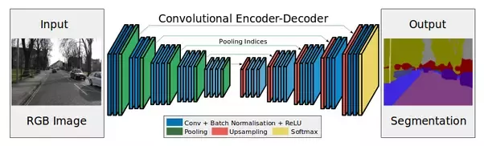

# Self Driving Car Simulator


**Vehicle Lane Detection**

Autonomous driving is on track to be one of the next big revolutions in the coming years. Autonomous driving is to be used thoughout an breadth
of industries including commerical, taxi, and personal. Autonomous vehicles require a perceptron module to comprehend
the environment around them. The job of this is to detect Lanes, detect objects, track objects, and predict motion.
In this project I use deep learning to detect vehicle lanes from road images. The model uses a fully convolutional neural network
which when given a driving image to predict on, outputs an image of a predicted lane.

## Dataset

- The data consists of a set of 12,764 raw training images along with marked lanes lanes used as labels for each image
- The labeled images were generated from polynomial coefficents marking the lane for each image
- Each image is downsized to a uniform format of (80x160x3)
- Training image data was taken from [here](https://www.dropbox.com/s/rrh8lrdclzlnxzv/full_CNN_train.p?dl=0)
- Training label data was taken from [here](https://www.dropbox.com/s/ak850zqqfy6ily0/full_CNN_labels.p?dl=0)
- Example images are contained in the example_images directory

## Running the code
**All code is stored in base directory**

The final CNN model used can is stored in this directory as *full_CNN_model.h5*

- To train the model, run
    ```
    python main.py
    ```
- To generate image predictiction, run
    ```
    python predict_lines.py
    ```

## Training

The best trained model uses a fully convoluational neural network
The model takes in the road image and encodes it up to a filter size of 1024 before decoding it back down to
the final layer with a filter size of 1. The encoder decoder architecture allows for differing input and output sequences. Additionally,
this allows for complex attributes in an image to be fully recognized.



The network is trained using mean squared error as the metric to minimize. This allows for lane predictions which significantly
deviate from the expected outcome to be penalized disproportionately high. The mean squared error is computed against the correct lavel image.
The Adam optimizer is used to minimize this loss as it is a popular choice for deep learning. The output layer of the model is regression as an image array which can
can be compared against the labeled image.


## Hypeparameter Selection
- Batch Size: 128
- Epochs: 10
- Dropout: 0.2

I decided to terminate the training at 10 epochs as the model loss seemed to converge relatively well while still before starting to overfit.


## Results


Baseline          |  Fully Deep CNN
:-------------------------:|:-------------------------:
 |  

Over the same range of epochs, the fully connected deep cnn model performed drastically better than the single layered baseline.
This is due to the added depth of the model which allows it to read much further into the complexity of each image. The deep model had a final mean squared error score of
around 1/4 that of the baseline model.


### Predicted Lane Segments on previously seen data
 |  | 


The model showed posed relatively accurate lane segments when predicting on the previously trained data. This is clear as the model has already been
fitted to this data with raw images and polynomial labels fitted to the data.


### Predicted Lane Segments on unseen data


When applying the model to unseen images, entire roadways tend to be marked rather than specific lanes.
This is likely due to the fact that lane markings can be difficult to identify as the difference in pixel color is not significant compared
to the pixel change between roadway and surrounding area.


The model seemed to struggle to predict lane markings when the road became particularly dark or shadowy. The model tends to break down when given dark and shadowy images,
since the training dataset contains little to none of them. Since the unseen dataset is does not have associated labels generated with each image for ground truth,
there would be no way to numerically evaluate the predictions without creating my own image label generator.


## Moving Forward
- I would like to generate predicted images on my own person driving data
- I plan to implement a transfer learning model using VGG16. This will handle the entirety of the encoding aspect of the Network
- Build a flask app which takes in a given lane image and generates overlayed lane markings for that image
- I want to combine the lane detection code with vehicle detection code using YOLO-V5
- Build app that generates road predictions in real time while driving with a camera recording
- Calcuate the radius of curvature for a lane in a given image

## Technologies Used
* [Matplotlib](https://matplotlib.org)
* [Pandas](https://pandas.pydata.org)
* [Tensorflow Keras](https://www.tensorflow.org/api_docs/python/tf/keras/Model)
* [OpenCV](https://pypi.org/project/opencv-python/)
* [NumPy](https://numpy.org)


### Citations:
-   Mvirgo. “Mvirgo/MLND-Capstone.” GitHub, github.com/mvirgo/MLND-Capstone.
-   Dwivedi, Priya. “Real-Time Lane Detection and Alerts for Autonomous Driving.” Medium, Towards Data Science, 15 Dec. 2020, towardsdatascience.com/real-time-lane-detection-and-alerts-for-autonomous-driving-1f0a021390ee.
-   Karunakaran, Dhanoop. “Semantic Segmentation - Udaity's Self-Driving Car Engineer Nanodegree.” Medium, Intro to Artificial Intelligence, 22 Aug. 2018, medium.com/intro-to-artificial-intelligence/semantic-segmentation-udaitys-self-driving-car-engineer-nanodegree-c01eb6eaf9d.
